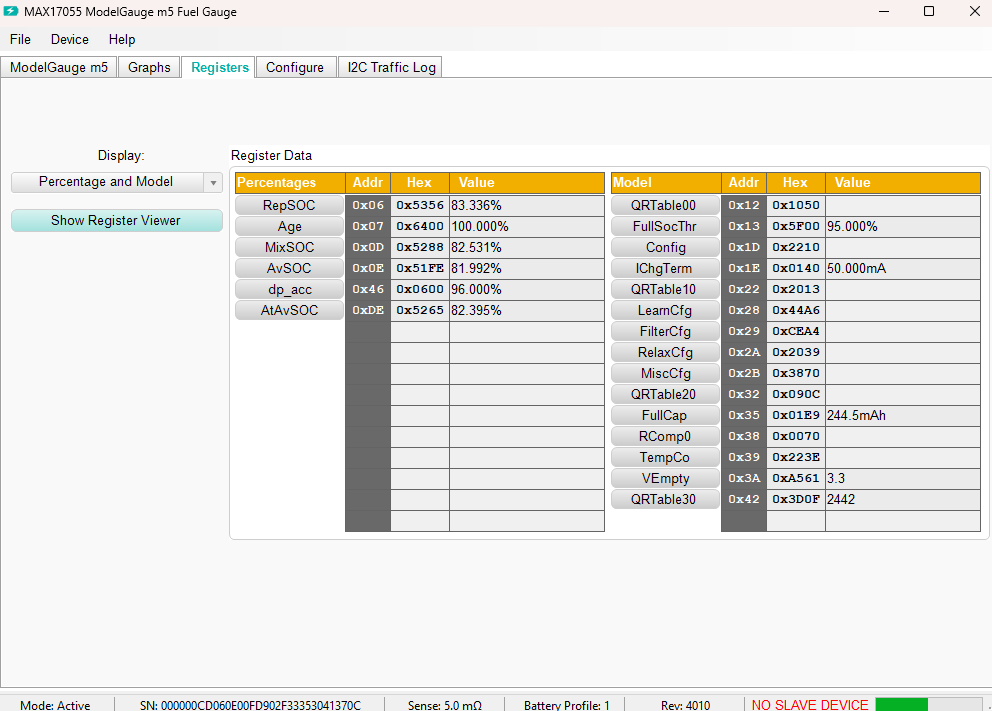
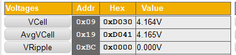
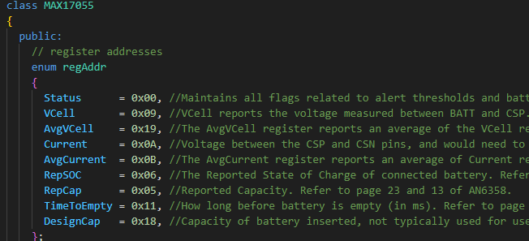
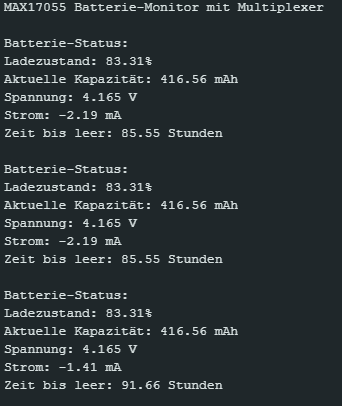
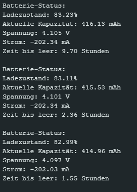
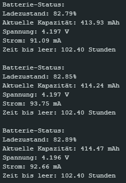
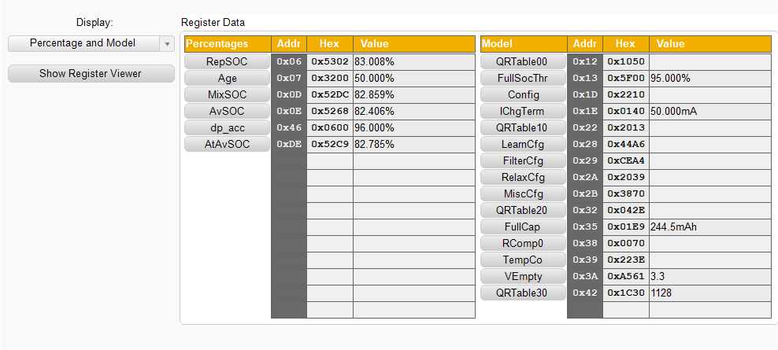

# Eingebettete Systeme

- ich habe zwei verschiedene Ansätze verfolgt
- im ersten Ansatz habe ich versucht, selber die Register auszulesen
- jedoch sind einige der Register bisher falsch gewesen
- deswegen habe ich mich auf die Suche nach fertigen Bibliotheken gemacht
- dabei bin ich auf eine gestoßen, dir für mich ganz gute funktioniert
- aber der Reihe nach, um einen guten Überblick darüberzu bekommen, was ich gemacht habe
- deswegen habe ich hier mal versucht eine strukturierte Dokumentation zu erstellen

**Problem**
- trotzdem gibt es ein kleines Problem
- die Platte mit dem 17055 spinnt ein wenig
- rot sollte laden sein (Schalter oben)
- blau sollte eintladen sein (Schalter unten)
- das entladen, (Schalter runter) funktioniert problemlos
- wenn ich jetzt aber wieder nach laden (Schalter hoch) wechseln will, muss ich die Platte mehrmals abziehen um wieder in den Lademodus zu kommen
- wenn ich im Lademodus bin, spring die Led zufällig wieder auf Blau um, obwohl der Schalter oben ist
- jedoch entlädt sich die Batterie dann nicht, weder lädt sie
- dann bleibt der Ladestand einfach gleich bis ich entweder den Schalter betätige oder die Platte 2-3 mal neu anstecke
- ist an sich kein Problem, aber beim esten nervig gewesen

**Ausgabe des Max17055 mit dem fertigen Programm**
- dank dieses Programms, hätte ich die korrekten Registries direkt gekannt

- hier werden die nämlich fein säuberlich angezeigt
- Akku ist hier bei **83,36%**
- meine Ergebnisse kennen Sie ja bereits, das war die Ausgabe des Programms aus dem Ordner **einsendung_alt**

    #define MULTIPLEXER_ADDR 0x70  // Adresse des Multiplexers (TCA9548)
    #define MAX17055_ADDR 0x36     // Adresse des Max17055
    #define MAX17055_REG_SOC 0x06  // Register für den Ladezustand (SOC)
    #define MAX17055_REG_VCELL 0x09 // Register für Zellenspannung (VCell)

- laut den beiden Abbildungen habe ich sogar auf die richtigen Adressen zugegriffen
- ich schätze mal ich habe irgendwo in der Berechnung oder Umrechnung einen Fehler
- oder ich habe einfach irgendetwas falsch initialisiert
- wie soll es auch anders sein, habe ich nach der Mail gestern nochmal recherchiert und hab dann tatsächlich eine Lösung gefunden

https://github.com/AwotG/Arduino-MAX17055_Driver/tree/master

- von diesem gitHub habe ich mir dann die [Arduino-MAX17055_Driver.cpp](../einsendung_neu/test/Arduino-MAX17055_Driver.cpp) und die [Arduino-MAX17055_Driver.h](../einsendung_neu/test/Arduino-MAX17055_Driver.h) geklaut und in ein neues Programm integriert
- im **.h** stehen 1:1 wieder die gleichen Adressen drinnen 

- zusammen mit der korrekten Adressierung des Multiplexers, komme ich dann tatsächlich auf sinnhafte Ergebnisse
- die gesamte Struktur findet sich im Ordner **einsendung_neu** und im entsprechenden Unterordner **test**
- die Struktur ist so gewählt, sodass ich das **.h** korrekt in der [MAX17055_Example.ino](../einsendung_neu/test/examples/MAX17055_Example/MAX17055_Example.ino) importieren kann
- die Datei ist auch entsprechend auskommentiert, sodass Sie sehen was ich mir dabei gedacht habe
- wenn wir das Programm dann laufen lassen, bekomme ich die folgende Ausgabe:

- so bleibt die Ausgabe die ganze Zeit übrigens, wenn die LED von Rot auf Blau gesprungen ist
- wenn ich den Schalter nach unten kippe, mit dem kleinsten Widerstand, erhalte ich folgende Ausgabe:

- und zuletzt wenn ich die LED auf Rot bekomme
- dann lädt das ganze auch ein bisschen, halt so lange bis die LED einfach wieder umspringt:

- und wenn ich das ganze wieder ans Tool stöpsle, ann sieht man auch ganz gut, dass die Werte meines Programmes stimmen

- diese minimale Abweichung ensteht halt immer dann, wenn ich das Board kurz abziehen muss, damit wenn ich laden will, die LED auch auf ROT geht und tatsächlich geladen wird
